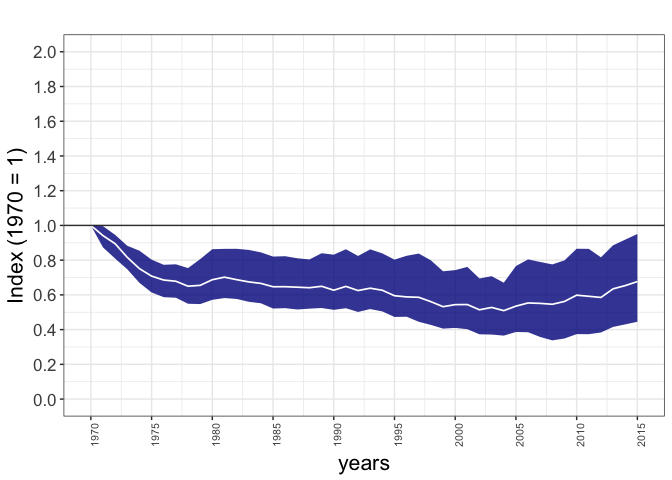
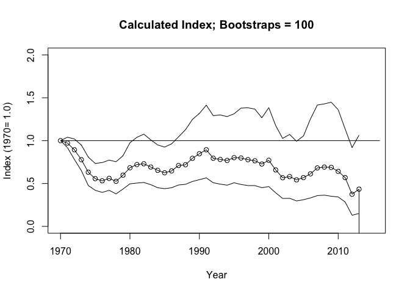
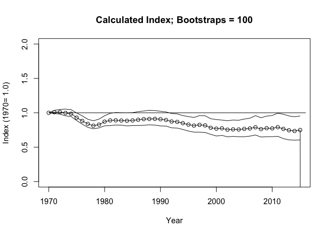
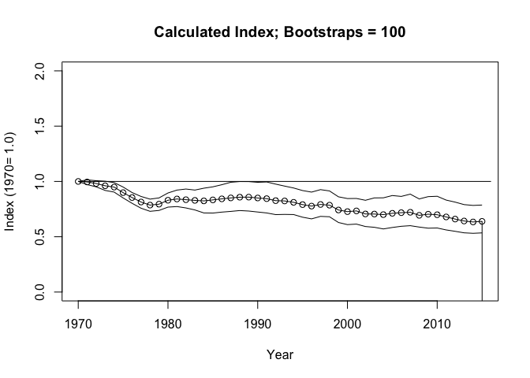
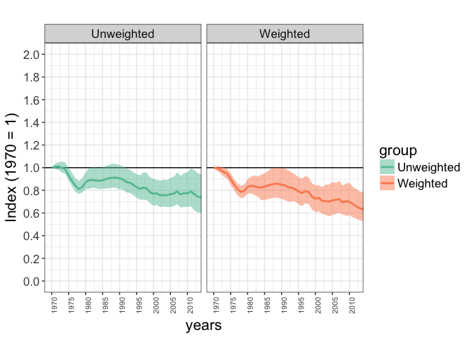

# rlpi package (beta)
Indicators and Assessment Unit, Institute of Zoology, Zoological Society of London^[Contact robin.freeman@ioz.ac.uk or louise.mcrae@ioz.ac.uk]  


##Using the rlpi package 

### Overview

The **rlpi** package (currently in beta/active development) calculates indices using the Living Planet Index methodology (McRae et al. (in review) *The diversity-weighted Living Planet Index: controlling for taxonomic bias in a global biodiversity indicator*).


> Note: We provide a Comma Separated Value version of the Living Planet Database [here](https://dx.doi.org/10.6084/m9.figshare.4300022.v1), but this excludes around 3000 populations which are confidential and cannot therefore be shared. Therefore, results produced with this data set may differ slightly from those presented in the manuscript and elsewhere.

In summary, indices are calculated using the geometric mean, first combining population trends to the species level, and then across higher taxonomic and geographical groupings. For example, multiple populations within a biogeographic realm will be combined first to generate individual species indices, then combined to taxonomic groups such as *birds*, *mammals*, *reptiles*, *amphibians*, and *fish* before being combined to an index for the biogeograhic realm.


The **rlpi** package works with source data in comma separated (csv) format where each row is composed  of **popid**, **speciesname**, **year**, **popvalue** (see below). These can be stored be in multiple groups (e.g. a file for Afrotropic bird populations, one for Afrotropical mammal populations, etc), and an 'infile' tells the package where these groups/files are and how to combine them. 

When constructing an index for just a single group, you need a single data file and a single
infile which points to that data file (see first example below). For multiple groups, the infile would refer to all relevant data files and can specify weightings to allow for taxonomic, geographic or other weighting.

The code below includes an example dataset for terrestrial vertebrates with a complex infile with multiple weighted groups, as well as a simple infile for Nearctic mammals.

NB: At present the code combines population time-series to the species level, generating an average index for each species, then combines these into higher groups.

### Installing the package and examples

First, install the devtools package to enable installing from github:


```r
install.packages("devtools")
```

Then install the **rlpi** package from our github:


```r
library(devtools)
# Install from main ZSL repository online
install_github("Zoological-Society-of-London/rlpi", auth_token = "3e95e9d1c26c0bd8f9fed628b224dbe811064c20", dependencies=TRUE)
```

Then the library can be loaded as normal


```r
# Load library
library(rlpi)
```

And some example data can be extracted from the package:


```r
# Get example data from package
# Copy zipped data to local directory 
file.copy(from=system.file("extdata", "example_data.zip", package = "rlpi"), to=getwd())
```

```
## [1] TRUE
```

```r
# Extract data, this will create a directory of terrestrial LPI data to construct a terrestrial index from.
unzip("example_data.zip")
```

## Example data

Within the example data are a number of 'infiles'. These files (take a look at them!) contain links to other files arranged into groups and include weightings. 

For example **terrestrial_class_nearctic_infile.txt** which constructs an index for a single group contains:

```
"FileName"	"Group"	"Weighting"
"example_data/T_Nearctic_Mammalia.txt"	1	0.175804093567251
```

For now, ignore the 'group' and 'weighting' columns as they are not used for a single group. This infile references a single 'population' data file (the raw data) in the class_realms folder which, in this case, contains population counts for Nearctic mammals (again, have a look) in the following format:

first six lines of **example_data/T_Nearctic_Mammalia.txt**:

```
Binomial	ID	year	popvalue
Ovis_canadensis	4618	1950	390
Ovis_canadensis	5328	1950	1500
Myodes_gapperi	4560	1952	17
Sorex_cinereus	4587	1952	3
Napaeozapus_insignis	4588	1952	18
...
```

## Creating an index using example data

Using these files to construct a Nearctic index can be done as follows:


```r
# Make a Neactic LPI 

# Default gives 100 boostraps (this takes a couple of minutes to run on a 2014 Macbook)
Nearc_lpi <- LPIMain("example_data/terrestrial_class_nearctic_infile.txt", use_weightings = 1, VERBOSE=FALSE, show_progress=FALSE)
```

```
## Weightings...
## [1] "Group: 1"
## 	[1] 0.3763665 0.2498699 0.3737637
## 	[1] "Normalised weights (sum to 1)"
## 	[1] 0.3763665 0.2498699 0.3737637
## 
## Number of groups:  1 
## processing file: example_data/T_Nearctic_aves_pops.txt
## Calculating LPI for Species
## Number of species: 377 (in 541 populations)
## 
## Saving species lambda to file: lpi_temp/d99a9bebbe6d94380af43e35d4ef17a3_splambda.csv
## Saving species lambda to file: example_data/T_Nearctic_aves_pops_lambda.csv
## Calculating DTemp
## Saving DTemp to file:  lpi_temp/d99a9bebbe6d94380af43e35d4ef17a3_dtemp.csv 
## Saving DTemp to file:  example_data/T_Nearctic_aves_pops_dtemp.csv 
## processing file: example_data/T_Nearctic_mammalia_pops.txt
## Calculating LPI for Species
## Number of species: 92 (in 384 populations)
## 
## Saving species lambda to file: lpi_temp/7282fa95486d2024ef7a6282067e0100_splambda.csv
## Saving species lambda to file: example_data/T_Nearctic_mammalia_pops_lambda.csv
## Calculating DTemp
## Saving DTemp to file:  lpi_temp/7282fa95486d2024ef7a6282067e0100_dtemp.csv 
## Saving DTemp to file:  example_data/T_Nearctic_mammalia_pops_dtemp.csv 
## processing file: example_data/T_Nearctic_herps_pops.txt
## Calculating LPI for Species
## Number of species: 58 (in 102 populations)
## 
## Saving species lambda to file: lpi_temp/ffa9d8ac9ddc787613f91b2f3f82a834_splambda.csv
## Saving species lambda to file: example_data/T_Nearctic_herps_pops_lambda.csv
## Calculating DTemp
## Saving DTemp to file:  lpi_temp/ffa9d8ac9ddc787613f91b2f3f82a834_dtemp.csv 
## Saving DTemp to file:  example_data/T_Nearctic_herps_pops_dtemp.csv 
## example_data/T_Nearctic_aves_pops.txt, Number of species: 377
## example_data/T_Nearctic_mammalia_pops.txt, Number of species: 92
## example_data/T_Nearctic_herps_pops.txt, Number of species: 58
## Saving DTemp Array to file:  example_data/terrestrial_class_nearctic_infile_dtemp_array.txt
```

```
## Warning: Removed 9 rows containing missing values (geom_path).
```

```
## Saving DTemp Array with filesnames to file:  example_data/terrestrial_class_nearctic_infile_dtemp_array_named.csv 
## [Calculating LPI...] System: 44.849000, User: 1.030000, Elapsed: 57.530000
## Group 1 is NA in year 47
## Number of valid index years: 46 (of possible 47)
## [Calculating CIs...] System: 45.002000, User: 1.033000, Elapsed: 57.721000
## ....................................................................................................
## [CIs calculated] System: 56.667000, User: 1.292000, Elapsed: 71.600000
```

<!-- -->

```
## Saving final output to file:  example_data/terrestrial_class_nearctic_infile_Results.txt 
## Saving Min/Max file to:  example_data/T_Nearctic_aves_pops_Minmax.txt 
## Saving Min/Max file to:  example_data/T_Nearctic_mammalia_pops_Minmax.txt 
## Saving Min/Max file to:  example_data/T_Nearctic_herps_pops_Minmax.txt 
## Saving Plot to PDF:  example_data/terrestrial_class_nearctic_infile.pdf 
## [END] System: 57.286000, User: 1.332000, Elapsed: 72.757000
```

```r
# Remove NAs (trailing years with no data)
Nearc_lpi <- Nearc_lpi[complete.cases(Nearc_lpi), ]
# This produces a simple plot, but we can use ggplot_lpi to produce a nicer version
ggplot_lpi(Nearc_lpi, ylims=c(0, 2))
```

<!-- -->

Similarly, infiles are provided for Nearctic mammals and birds:


```r
# Make a Neactic Mammals LPI 
# Default gives 100 boostraps (this will take a few minutes to run on a 2014 Macbook)
Nearc_mams_lpi <- LPIMain("example_data/T_Nearctic_mammalia_infile.txt", VERBOSE=FALSE, show_progress=FALSE)
```

```
## Number of groups:  1 
## processing file: example_data/T_Nearctic_mammalia_pops.txt
## Calculating LPI for Species
## Number of species: 92 (in 384 populations)
## 
## Saving species lambda to file: lpi_temp/7282fa95486d2024ef7a6282067e0100_splambda.csv
## Saving species lambda to file: example_data/T_Nearctic_mammalia_pops_lambda.csv
## Calculating DTemp
## Saving DTemp to file:  lpi_temp/7282fa95486d2024ef7a6282067e0100_dtemp.csv 
## Saving DTemp to file:  example_data/T_Nearctic_mammalia_pops_dtemp.csv 
## example_data/T_Nearctic_mammalia_pops.txt, Number of species: 92
## Saving DTemp Array to file:  example_data/T_Nearctic_mammalia_infile_dtemp_array.txt
```

```
## Warning: Removed 4 rows containing missing values (geom_path).
```

```
## Saving DTemp Array with filesnames to file:  example_data/T_Nearctic_mammalia_infile_dtemp_array_named.csv 
## [Calculating LPI...] System: 8.691000, User: 0.218000, Elapsed: 11.360000
## Group 1 is NA in year 45
## Group 1 is NA in year 46
## Group 1 is NA in year 47
## Number of valid index years: 44 (of possible 47)
## [Calculating CIs...] System: 8.762000, User: 0.220000, Elapsed: 11.551000
## ....................................................................................................
## [CIs calculated] System: 12.650000, User: 0.432000, Elapsed: 16.832000
```

<!-- -->

```
## Saving final output to file:  example_data/T_Nearctic_mammalia_infile_Results.txt 
## Saving Min/Max file to:  example_data/T_Nearctic_mammalia_pops_Minmax.txt 
## Saving Plot to PDF:  example_data/T_Nearctic_mammalia_infile.pdf 
## [END] System: 12.819000, User: 0.438000, Elapsed: 17.023000
```

```r
# Remove NAs (trailing years with no data)
Nearc_mams_lpi <- Nearc_mams_lpi[complete.cases(Nearc_mams_lpi), ]
# Nicer plot
ggplot_lpi(Nearc_mams_lpi, ylims=c(0, 2))
```

<!-- -->

```r
# Make a Neactic Mammals LPI 
# Default gives 100 boostraps (this will take a few minutes to run on a 2014 Macbook)
Nearc_birds_lpi <- LPIMain("example_data/terrestrial_Nearctic_Aves_infile.txt", VERBOSE=FALSE, show_progress=FALSE)
```

```
## Number of groups:  1 
## processing file: example_data/terrestrial_Nearctic_Aves_pops.txt
## Calculating LPI for Species
## Number of species: 377 (in 541 populations)
## 
## Saving species lambda to file: lpi_temp/d99a9bebbe6d94380af43e35d4ef17a3_splambda.csv
## Saving species lambda to file: example_data/terrestrial_Nearctic_Aves_pops_lambda.csv
## Calculating DTemp
## Saving DTemp to file:  lpi_temp/d99a9bebbe6d94380af43e35d4ef17a3_dtemp.csv 
## Saving DTemp to file:  example_data/terrestrial_Nearctic_Aves_pops_dtemp.csv 
## example_data/terrestrial_Nearctic_Aves_pops.txt, Number of species: 377
## Saving DTemp Array to file:  example_data/terrestrial_Nearctic_Aves_infile_dtemp_array.txt
```

```
## Warning: Removed 3 rows containing missing values (geom_path).
```

```
## Saving DTemp Array with filesnames to file:  example_data/terrestrial_Nearctic_Aves_infile_dtemp_array_named.csv 
## [Calculating LPI...] System: 37.138000, User: 0.892000, Elapsed: 47.411000
## Group 1 is NA in year 46
## Group 1 is NA in year 47
## Number of valid index years: 45 (of possible 47)
## [Calculating CIs...] System: 37.218000, User: 0.893000, Elapsed: 47.535000
## ....................................................................................................
## [CIs calculated] System: 42.676000, User: 1.027000, Elapsed: 54.203000
```

<!-- -->

```
## Saving final output to file:  example_data/terrestrial_Nearctic_Aves_infile_Results.txt 
## Saving Min/Max file to:  example_data/terrestrial_Nearctic_Aves_pops_Minmax.txt 
## Saving Plot to PDF:  example_data/terrestrial_Nearctic_Aves_infile.pdf 
## [END] System: 43.037000, User: 1.037000, Elapsed: 54.686000
```

```r
# Remove NAs (trailing years with no data)
Nearc_birds_lpi <- Nearc_birds_lpi[complete.cases(Nearc_birds_lpi), ]
# Nicer plot
ggplot_lpi(Nearc_birds_lpi, ylims=c(0, 2))
```

<!-- -->

```r
# We can also combine the two LPIs together in a list
lpis <- list(Nearc_birds_lpi, Nearc_mams_lpi)

# And plot them together 
ggplot_multi_lpi(lpis, xlims=c(1970, 2012), ylims=c(0, 3))
```

<!-- -->

```r
# We can also plot these next to each other, and use some more meaningful titles
ggplot_multi_lpi(lpis, names=c("Birds", "Mammals"), xlims=c(1970, 2012), ylims=c(0, 3), facet=TRUE)
```

<!-- -->

## Creating an index using example data (multiple groups and weightings)

This more complex example calculates an index for the terrestrial system, using the input file ***example_data/terrestrial_class_realms_infile.txt***, which has the following format:

```
FileName	Group	Weighting	WeightingB
example_data/T_Afrotropical_aves_pops.txt	1	0.387205957	0.189737662
example_data/T_Afrotropical_mammalia_pops.txt	1	0.197833813	0.189737662
example_data/T_Afrotropical_herps_pops.txt	1	0.41496023	0.189737662
example_data/T_IndoPacific_aves_pops.txt	2	0.396527091	0.292168385
example_data/T_IndoPacific_mammalia_pops.txt	2	0.172106825	0.292168385
example_data/T_IndoPacific_herps_pops.txt	2	0.431366084	0.292168385
example_data/T_Palearctic_aves_pops.txt	3	0.433535576	0.116430659
example_data/T_Palearctic_mammalia_pops.txt	3	0.249862107	0.116430659
example_data/T_Palearctic_herps_pops.txt	3	0.316602317	0.116430659
example_data/T_Neotropical_aves_pops.txt	4	0.387661234	0.321131554
example_data/T_Neotropical_mammalia_pops.txt	4	0.127987201	0.321131554
example_data/T_Neotropical_herps_pops.txt	4	0.484351565	0.321131554
example_data/T_Nearctic_aves_pops.txt	5	0.376366476	0.061683203
example_data/T_Nearctic_mammalia_pops.txt	5	0.249869859	0.061683203
example_data/T_Nearctic_herps_pops.txt	5	0.373763665	0.061683203
```

This input file refers to 15 different population files, divided into 5 groups (in this case, biogeographic realms) using the "Group" column with different taxonomic groups within these. So group 1 is for the 'Afrotropical' realm and has three population files (Aves, Mammalia and Herps). Weightings are given for these taxonomic groups which specify how much weight each taxonomic group has within its realm index (the weights used here reflect the proportion of species in that taxonomic group in that realm). 


```r
# Whole terrestrial...

# Create a terrestrial index, without using any specified weightings ('use_weightings=0' - so treating taxonomic groups equally at one level, and biogeographic realms equally at the next)
terr_lpi_a <- LPIMain("example_data/terrestrial_infile.txt", PLOT_MAX=2015, use_weightings=0, VERBOSE=FALSE, show_progress=FALSE)
```

```
## Number of groups:  5 
## processing file: example_data/T_Afrotropical_aves_pops.txt
## Calculating LPI for Species
## Number of species: 51 (in 98 populations)
## 
## Saving species lambda to file: lpi_temp/85db2b2ed287005006caf1aade6360c8_splambda.csv
## Saving species lambda to file: example_data/T_Afrotropical_aves_pops_lambda.csv
## Calculating DTemp
## Saving DTemp to file:  lpi_temp/85db2b2ed287005006caf1aade6360c8_dtemp.csv 
## Saving DTemp to file:  example_data/T_Afrotropical_aves_pops_dtemp.csv 
## processing file: example_data/T_Afrotropical_mammalia_pops.txt
## Calculating LPI for Species
## Number of species: 121 (in 608 populations)
## 
## Saving species lambda to file: lpi_temp/d168b6157c5ab5c46c44684d27c9d0f7_splambda.csv
## Saving species lambda to file: example_data/T_Afrotropical_mammalia_pops_lambda.csv
## Calculating DTemp
## Saving DTemp to file:  lpi_temp/d168b6157c5ab5c46c44684d27c9d0f7_dtemp.csv 
## Saving DTemp to file:  example_data/T_Afrotropical_mammalia_pops_dtemp.csv 
## processing file: example_data/T_Afrotropical_herps_pops.txt
## Calculating LPI for Species
## Number of species: 16 (in 20 populations)
## 
## Saving species lambda to file: lpi_temp/9c0c3a317824288e81d7206c98751a89_splambda.csv
## Saving species lambda to file: example_data/T_Afrotropical_herps_pops_lambda.csv
## Calculating DTemp
## Saving DTemp to file:  lpi_temp/9c0c3a317824288e81d7206c98751a89_dtemp.csv 
## Saving DTemp to file:  example_data/T_Afrotropical_herps_pops_dtemp.csv 
## processing file: example_data/T_IndoPacific_aves_pops.txt
## Calculating LPI for Species
## Number of species: 160 (in 367 populations)
## 
## Saving species lambda to file: lpi_temp/70eae6ab019ec96c4e762ba38c5e3893_splambda.csv
## Saving species lambda to file: example_data/T_IndoPacific_aves_pops_lambda.csv
## Calculating DTemp
## Saving DTemp to file:  lpi_temp/70eae6ab019ec96c4e762ba38c5e3893_dtemp.csv 
## Saving DTemp to file:  example_data/T_IndoPacific_aves_pops_dtemp.csv 
## processing file: example_data/T_IndoPacific_mammalia_pops.txt
## Calculating LPI for Species
## Number of species: 92 (in 196 populations)
## 
## Saving species lambda to file: lpi_temp/2ac92e5911c4b023fc1724098c5f6f46_splambda.csv
## Saving species lambda to file: example_data/T_IndoPacific_mammalia_pops_lambda.csv
## Calculating DTemp
## Saving DTemp to file:  lpi_temp/2ac92e5911c4b023fc1724098c5f6f46_dtemp.csv 
## Saving DTemp to file:  example_data/T_IndoPacific_mammalia_pops_dtemp.csv 
## processing file: example_data/T_IndoPacific_herps_pops.txt
## Calculating LPI for Species
## Number of species: 36 (in 47 populations)
## 
## Saving species lambda to file: lpi_temp/fb79817762cc8d1c8806fce3aed7b836_splambda.csv
## Saving species lambda to file: example_data/T_IndoPacific_herps_pops_lambda.csv
## Calculating DTemp
## Saving DTemp to file:  lpi_temp/fb79817762cc8d1c8806fce3aed7b836_dtemp.csv 
## Saving DTemp to file:  example_data/T_IndoPacific_herps_pops_dtemp.csv 
## processing file: example_data/T_Palearctic_aves_pops.txt
## Calculating LPI for Species
## Number of species: 214 (in 674 populations)
## 
## Saving species lambda to file: lpi_temp/af24509738e07b36ffebf72602956ac8_splambda.csv
## Saving species lambda to file: example_data/T_Palearctic_aves_pops_lambda.csv
## Calculating DTemp
## Saving DTemp to file:  lpi_temp/af24509738e07b36ffebf72602956ac8_dtemp.csv 
## Saving DTemp to file:  example_data/T_Palearctic_aves_pops_dtemp.csv 
## processing file: example_data/T_Palearctic_mammalia_pops.txt
## Calculating LPI for Species
## Number of species: 93 (in 481 populations)
## 
## Saving species lambda to file: lpi_temp/6ca404c848b2f2fdf28c00f4c9367027_splambda.csv
## Saving species lambda to file: example_data/T_Palearctic_mammalia_pops_lambda.csv
## Calculating DTemp
## Saving DTemp to file:  lpi_temp/6ca404c848b2f2fdf28c00f4c9367027_dtemp.csv 
## Saving DTemp to file:  example_data/T_Palearctic_mammalia_pops_dtemp.csv 
## processing file: example_data/T_Palearctic_herps_pops.txt
## Calculating LPI for Species
## Number of species: 20 (in 35 populations)
## 
## Saving species lambda to file: lpi_temp/5c96fcb8c89fc1b6d7a9cd47cf08c91d_splambda.csv
## Saving species lambda to file: example_data/T_Palearctic_herps_pops_lambda.csv
## Calculating DTemp
## Saving DTemp to file:  lpi_temp/5c96fcb8c89fc1b6d7a9cd47cf08c91d_dtemp.csv 
## Saving DTemp to file:  example_data/T_Palearctic_herps_pops_dtemp.csv 
## processing file: example_data/T_Neotropical_aves_pops.txt
## Calculating LPI for Species
## Number of species: 250 (in 298 populations)
## 
## Saving species lambda to file: lpi_temp/7260b846675aef1d8a9497c72ee3d29b_splambda.csv
## Saving species lambda to file: example_data/T_Neotropical_aves_pops_lambda.csv
## Calculating DTemp
## Saving DTemp to file:  lpi_temp/7260b846675aef1d8a9497c72ee3d29b_dtemp.csv 
## Saving DTemp to file:  example_data/T_Neotropical_aves_pops_dtemp.csv 
## processing file: example_data/T_Neotropical_mammalia_pops.txt
## Calculating LPI for Species
## Number of species: 74 (in 117 populations)
## 
## Saving species lambda to file: lpi_temp/14aa9cfa73ff66fd9dd00238e7778352_splambda.csv
## Saving species lambda to file: example_data/T_Neotropical_mammalia_pops_lambda.csv
## Calculating DTemp
## Saving DTemp to file:  lpi_temp/14aa9cfa73ff66fd9dd00238e7778352_dtemp.csv 
## Saving DTemp to file:  example_data/T_Neotropical_mammalia_pops_dtemp.csv 
## processing file: example_data/T_Neotropical_herps_pops.txt
## Calculating LPI for Species
## Number of species: 58 (in 109 populations)
## 
## Saving species lambda to file: lpi_temp/5c379af702d42665e0e9c34666fb86c0_splambda.csv
## Saving species lambda to file: example_data/T_Neotropical_herps_pops_lambda.csv
## Calculating DTemp
## Saving DTemp to file:  lpi_temp/5c379af702d42665e0e9c34666fb86c0_dtemp.csv 
## Saving DTemp to file:  example_data/T_Neotropical_herps_pops_dtemp.csv 
## processing file: example_data/T_Nearctic_aves_pops.txt
## Calculating LPI for Species
## Number of species: 377 (in 541 populations)
## 
## Saving species lambda to file: lpi_temp/d99a9bebbe6d94380af43e35d4ef17a3_splambda.csv
## Saving species lambda to file: example_data/T_Nearctic_aves_pops_lambda.csv
## Calculating DTemp
## Saving DTemp to file:  lpi_temp/d99a9bebbe6d94380af43e35d4ef17a3_dtemp.csv 
## Saving DTemp to file:  example_data/T_Nearctic_aves_pops_dtemp.csv 
## processing file: example_data/T_Nearctic_mammalia_pops.txt
## Calculating LPI for Species
## Number of species: 92 (in 384 populations)
## 
## Saving species lambda to file: lpi_temp/7282fa95486d2024ef7a6282067e0100_splambda.csv
## Saving species lambda to file: example_data/T_Nearctic_mammalia_pops_lambda.csv
## Calculating DTemp
## Saving DTemp to file:  lpi_temp/7282fa95486d2024ef7a6282067e0100_dtemp.csv 
## Saving DTemp to file:  example_data/T_Nearctic_mammalia_pops_dtemp.csv 
## processing file: example_data/T_Nearctic_herps_pops.txt
## Calculating LPI for Species
## Number of species: 58 (in 102 populations)
## 
## Saving species lambda to file: lpi_temp/ffa9d8ac9ddc787613f91b2f3f82a834_splambda.csv
## Saving species lambda to file: example_data/T_Nearctic_herps_pops_lambda.csv
## Calculating DTemp
## Saving DTemp to file:  lpi_temp/ffa9d8ac9ddc787613f91b2f3f82a834_dtemp.csv 
## Saving DTemp to file:  example_data/T_Nearctic_herps_pops_dtemp.csv 
## example_data/T_Afrotropical_aves_pops.txt, Number of species: 51
## example_data/T_Afrotropical_mammalia_pops.txt, Number of species: 121
## example_data/T_Afrotropical_herps_pops.txt, Number of species: 16
## example_data/T_IndoPacific_aves_pops.txt, Number of species: 160
## example_data/T_IndoPacific_mammalia_pops.txt, Number of species: 92
## example_data/T_IndoPacific_herps_pops.txt, Number of species: 36
## example_data/T_Palearctic_aves_pops.txt, Number of species: 214
## example_data/T_Palearctic_mammalia_pops.txt, Number of species: 93
## example_data/T_Palearctic_herps_pops.txt, Number of species: 20
## example_data/T_Neotropical_aves_pops.txt, Number of species: 250
## example_data/T_Neotropical_mammalia_pops.txt, Number of species: 74
## example_data/T_Neotropical_herps_pops.txt, Number of species: 58
## example_data/T_Nearctic_aves_pops.txt, Number of species: 377
## example_data/T_Nearctic_mammalia_pops.txt, Number of species: 92
## example_data/T_Nearctic_herps_pops.txt, Number of species: 58
## Saving DTemp Array to file:  example_data/terrestrial_infile_dtemp_array.txt
```

```
## Warning: Removed 80 rows containing missing values (geom_path).
```

```
## Saving DTemp Array with filesnames to file:  example_data/terrestrial_infile_dtemp_array_named.csv 
## [Calculating LPI...] System: 82.916000, User: 1.104000, Elapsed: 86.685000
## Group 2 is NA in year 45
## Group 3 is NA in year 45
## Group 2 is NA in year 46
## Group 3 is NA in year 46
## Group 1 is NA in year 47
## Group 2 is NA in year 47
## Group 3 is NA in year 47
## Group 4 is NA in year 47
## Group 5 is NA in year 47
## Number of valid index years: 46 (of possible 47)
## [Calculating CIs...] System: 83.432000, User: 1.108000, Elapsed: 87.216000
## ....................................................................................................
## [CIs calculated] System: 139.781000, User: 1.767000, Elapsed: 145.351000
```

<!-- -->

```
## Saving final output to file:  example_data/terrestrial_infile_Results.txt 
## Saving Min/Max file to:  example_data/T_Afrotropical_aves_pops_Minmax.txt 
## Saving Min/Max file to:  example_data/T_Afrotropical_mammalia_pops_Minmax.txt 
## Saving Min/Max file to:  example_data/T_Afrotropical_herps_pops_Minmax.txt 
## Saving Min/Max file to:  example_data/T_IndoPacific_aves_pops_Minmax.txt 
## Saving Min/Max file to:  example_data/T_IndoPacific_mammalia_pops_Minmax.txt 
## Saving Min/Max file to:  example_data/T_IndoPacific_herps_pops_Minmax.txt 
## Saving Min/Max file to:  example_data/T_Palearctic_aves_pops_Minmax.txt 
## Saving Min/Max file to:  example_data/T_Palearctic_mammalia_pops_Minmax.txt 
## Saving Min/Max file to:  example_data/T_Palearctic_herps_pops_Minmax.txt 
## Saving Min/Max file to:  example_data/T_Neotropical_aves_pops_Minmax.txt 
## Saving Min/Max file to:  example_data/T_Neotropical_mammalia_pops_Minmax.txt 
## Saving Min/Max file to:  example_data/T_Neotropical_herps_pops_Minmax.txt 
## Saving Min/Max file to:  example_data/T_Nearctic_aves_pops_Minmax.txt 
## Saving Min/Max file to:  example_data/T_Nearctic_mammalia_pops_Minmax.txt 
## Saving Min/Max file to:  example_data/T_Nearctic_herps_pops_Minmax.txt 
## Saving Plot to PDF:  example_data/terrestrial_infile.pdf 
## [END] System: 141.042000, User: 1.790000, Elapsed: 146.703000
```

```r
# Remove NAs (trailing years with no data)
terr_lpi_a <- terr_lpi_a[complete.cases(terr_lpi_a), ]

# Run same again and now weight by class, but weight equally across realms (see infile for weights)
terr_lpi_b <- LPIMain("example_data/terrestrial_infile.txt", PLOT_MAX=2015, force_recalculation=0, use_weightings=1, VERBOSE=FALSE, show_progress=FALSE)
```

```
## Weightings...
## [1] "Group: 1"
## 	[1] 0.3872060 0.1978338 0.4149602
## 	[1] "Normalised weights (sum to 1)"
## 	[1] 0.3872060 0.1978338 0.4149602
## [1] "Group: 2"
## 	[1] 0.3965271 0.1721068 0.4313661
## 	[1] "Normalised weights (sum to 1)"
## 	[1] 0.3965271 0.1721068 0.4313661
## [1] "Group: 3"
## 	[1] 0.4335356 0.2498621 0.3166023
## 	[1] "Normalised weights (sum to 1)"
## 	[1] 0.4335356 0.2498621 0.3166023
## [1] "Group: 4"
## 	[1] 0.3876612 0.1279872 0.4843516
## 	[1] "Normalised weights (sum to 1)"
## 	[1] 0.3876612 0.1279872 0.4843516
## [1] "Group: 5"
## 	[1] 0.3763665 0.2498699 0.3737637
## 	[1] "Normalised weights (sum to 1)"
## 	[1] 0.3763665 0.2498699 0.3737637
## 
## Number of groups:  5 
## example_data/T_Afrotropical_aves_pops.txt, Number of species: 51
## example_data/T_Afrotropical_mammalia_pops.txt, Number of species: 121
## example_data/T_Afrotropical_herps_pops.txt, Number of species: 16
## example_data/T_IndoPacific_aves_pops.txt, Number of species: 160
## example_data/T_IndoPacific_mammalia_pops.txt, Number of species: 92
## example_data/T_IndoPacific_herps_pops.txt, Number of species: 36
## example_data/T_Palearctic_aves_pops.txt, Number of species: 214
## example_data/T_Palearctic_mammalia_pops.txt, Number of species: 93
## example_data/T_Palearctic_herps_pops.txt, Number of species: 20
## example_data/T_Neotropical_aves_pops.txt, Number of species: 250
## example_data/T_Neotropical_mammalia_pops.txt, Number of species: 74
## example_data/T_Neotropical_herps_pops.txt, Number of species: 58
## example_data/T_Nearctic_aves_pops.txt, Number of species: 377
## example_data/T_Nearctic_mammalia_pops.txt, Number of species: 92
## example_data/T_Nearctic_herps_pops.txt, Number of species: 58
## Saving DTemp Array to file:  example_data/terrestrial_infile_dtemp_array.txt
```

```
## Warning: Removed 80 rows containing missing values (geom_path).
```

```
## Saving DTemp Array with filesnames to file:  example_data/terrestrial_infile_dtemp_array_named.csv 
## [Calculating LPI...] System: 0.725000, User: 0.028000, Elapsed: 0.798000
## Group 2 is NA in year 45
## Group 3 is NA in year 45
## Group 2 is NA in year 46
## Group 3 is NA in year 46
## Group 1 is NA in year 47
## Group 2 is NA in year 47
## Group 3 is NA in year 47
## Group 4 is NA in year 47
## Group 5 is NA in year 47
## Number of valid index years: 46 (of possible 47)
## [Calculating CIs...] System: 1.362000, User: 0.047000, Elapsed: 1.505000
## ....................................................................................................
## [CIs calculated] System: 56.544000, User: 0.535000, Elapsed: 57.976000
```

<!-- -->

```
## Saving final output to file:  example_data/terrestrial_infile_Results.txt 
## Saving Min/Max file to:  example_data/T_Afrotropical_aves_pops_Minmax.txt 
## Saving Min/Max file to:  example_data/T_Afrotropical_mammalia_pops_Minmax.txt 
## Saving Min/Max file to:  example_data/T_Afrotropical_herps_pops_Minmax.txt 
## Saving Min/Max file to:  example_data/T_IndoPacific_aves_pops_Minmax.txt 
## Saving Min/Max file to:  example_data/T_IndoPacific_mammalia_pops_Minmax.txt 
## Saving Min/Max file to:  example_data/T_IndoPacific_herps_pops_Minmax.txt 
## Saving Min/Max file to:  example_data/T_Palearctic_aves_pops_Minmax.txt 
## Saving Min/Max file to:  example_data/T_Palearctic_mammalia_pops_Minmax.txt 
## Saving Min/Max file to:  example_data/T_Palearctic_herps_pops_Minmax.txt 
## Saving Min/Max file to:  example_data/T_Neotropical_aves_pops_Minmax.txt 
## Saving Min/Max file to:  example_data/T_Neotropical_mammalia_pops_Minmax.txt 
## Saving Min/Max file to:  example_data/T_Neotropical_herps_pops_Minmax.txt 
## Saving Min/Max file to:  example_data/T_Nearctic_aves_pops_Minmax.txt 
## Saving Min/Max file to:  example_data/T_Nearctic_mammalia_pops_Minmax.txt 
## Saving Min/Max file to:  example_data/T_Nearctic_herps_pops_Minmax.txt 
## Saving Plot to PDF:  example_data/terrestrial_infile.pdf 
## [END] System: 57.808000, User: 0.554000, Elapsed: 59.286000
```

```r
# Remove NAs (trailing years with no data)
terr_lpi_b <- terr_lpi_b[complete.cases(terr_lpi_b), ]

# Putting the two LPIs together in a list
lpis_comp <- list(terr_lpi_a, terr_lpi_b)

# And plotting them together 
ggplot_multi_lpi(lpis_comp, xlims=c(1970, 2012), names=c("Unweighted", "Weighted"), facet=TRUE)
```

<!-- -->

## See Also - Creating infiles

Some functions are also provided for creating infiles from tabular data: [Creating Infiles](creating_infiles.md)


```
```


