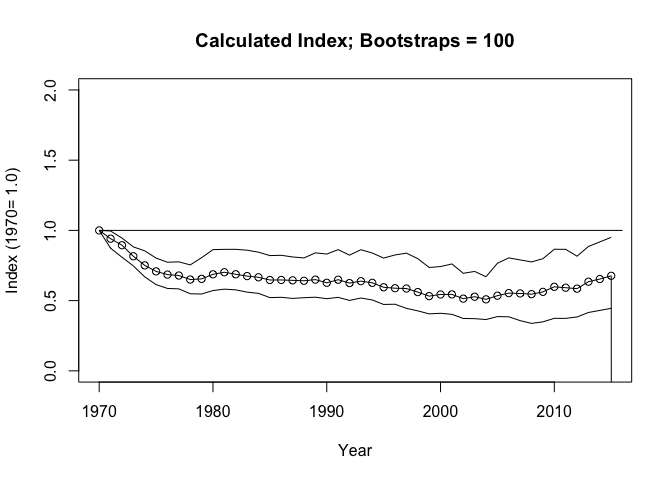
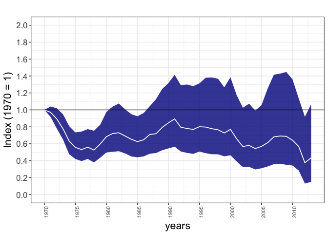
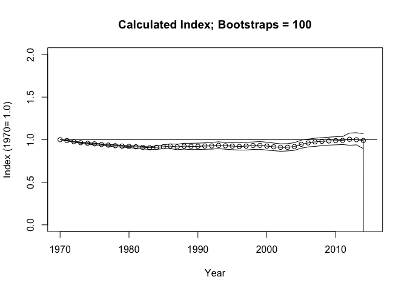
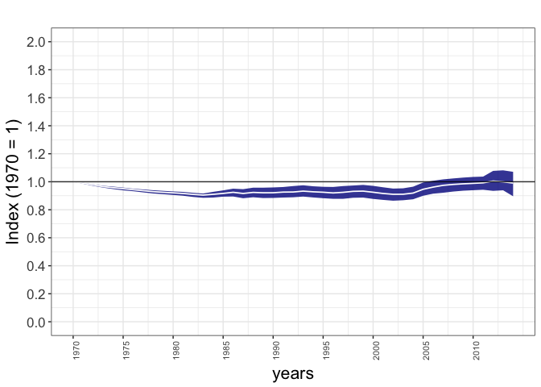
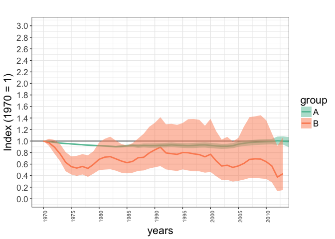

# rlpi package
Louise McRae, Stefanie Deinet, Robin Freeman, IoZ, Zoological Society of London  
`r format(Sys.Date())`  


##Using the rlpi package 

### Overview

The **rlpi** package calculates indices using the Living Planet Index methodology, as presented in McRae et al. (in review) *The diversity weighted Living Planet Index: controlling for taxonomic bias in a global biodiversity index*.

In summary, indices are calculated using the geometric mean, first combining population trends to the species level, and then across higher taxonomic and geographical groupings. For example, multiple populations within a biogeographic realm will be combined first to generate individual species indices, then combined to taxonomic groups such as *birds*, *mammals*, *reptiles*, *amphibians*, before being combined to an index for the biogeograhic realm

The **rlpi** package works with source data in comma separated (csv) format where each row is composed 
of **popid**, **speciesname**, **year**, **popvalue** (see below). These can be stored be in multiple groups (e.g. a file for Afrotropic bird populations, one for Afrotropical mammal populations, etc), and an 'infile' tells the package where these groups/files are and how to combine them. 

When constructing an index for just a single group, you need a single data file and a single
infile which points to that data file (see first example below). For multiple groups, the infile would refer to all relevant data files and can specify weightings to allow for taxonomic, geographic or other weighting.

The code below includes an example dataset for terrestrial vertebrates with a complex infile with multiple weighted groups, as well as a simple infile for Nearctic mammals.

NB: At present the code combines population time-series to the species level, generating an average index for each species, then combines these into higher groups.

### Installing the package and examples

First, install the devtools package to enable installing from github:


```r
install.packages("devtools")
```

Then install the **rlpi** package from our github:


```r
library(devtools)
# Install from main ZSL repository online
install_github("Zoological-Society-of-London/rlpi", auth_token = "3e95e9d1c26c0bd8f9fed628b224dbe811064c20", dependencies=TRUE)
```

Then the library can be loaded as normal


```r
# Load library
library(rlpi)
```

And some example data can be extracted from the package:


```r
# Get example data from package
# Copy zipped data to local directory 
file.copy(from=system.file("extdata", "example_data.zip", package = "rlpi"), to=getwd())
# Extract data, this will create a directory of terrestrial LPI data to construct a terrestrial index from.
unzip("example_data.zip")
```

## Example data

Within the example data are a number of 'infiles'. These files (take a look at them!) contain links to other files arranged into groups and include weightings. 

For example **terrestrial_class_nearctic_infile.txt** which constructs an index for a single group contains:

```
"FileName"	"Group"	"Weighting"
"example_data/T_Nearctic_Mammalia.txt"	1	0.175804093567251
```

For now, ignore the 'group' and 'weighting' columns as they are not used for a single group. This infile references a single 'population' data file (the raw data) in the class_realms folder which, in this case, contains population counts for Nearctic mammals (again, have a look) in the following format:

first six lines of **example_data/T_Nearctic_Mammalia.txt**:

```
Binomial	ID	year	popvalue
Ovis_canadensis	4618	1950	390
Ovis_canadensis	5328	1950	1500
Myodes_gapperi	4560	1952	17
Sorex_cinereus	4587	1952	3
Napaeozapus_insignis	4588	1952	18
...
```

## Creating an index using example data

Using these files to contruct a Neartic index can be done as follows:


```r
# Make a Neactic LPI 
# Default gives 100 boostraps (this takes a couple of minutes to run on a 2014 Macbook)
Nearc_lpi <- LPIMain("example_data/terrestrial_class_nearctic_infile.txt", use_weightings = 1)
```

```
## Warning in read.table(infile, header = TRUE): incomplete final line found
## by readTableHeader on 'example_data/terrestrial_class_nearctic_infile.txt'
```

```
## Weightings...
## [1] "Group: 1"
## 	[1] 0.3763665 0.2498699 0.3737637
## 	[1] "Normalised weights (sum to 1)"
## 	[1] 0.3763665 0.2498699 0.3737637
## 
## Number of groups:  1 
## processing file: example_data/T_Nearctic_Aves_pops.txt
## Calculating LPI for Species
## Number of species: 377 (in 541 populations)
## 
## Saving species lambda to file: lpi_temp/d99a9bebbe6d94380af43e35d4ef17a3_splambda.csv
## Saving species lambda to file: example_data/T_Nearctic_Aves_pops_lambda.csv
## Calculating DTemp
## Saving DTemp to file:  lpi_temp/d99a9bebbe6d94380af43e35d4ef17a3_dtemp.csv 
## Saving DTemp to file:  example_data/T_Nearctic_Aves_pops_dtemp.csv 
## processing file: example_data/T_Nearctic_Mammalia_pops.txt
## Calculating LPI for Species
## Number of species: 92 (in 384 populations)
## 
## Saving species lambda to file: lpi_temp/7282fa95486d2024ef7a6282067e0100_splambda.csv
## Saving species lambda to file: example_data/T_Nearctic_Mammalia_pops_lambda.csv
## Calculating DTemp
## Saving DTemp to file:  lpi_temp/7282fa95486d2024ef7a6282067e0100_dtemp.csv 
## Saving DTemp to file:  example_data/T_Nearctic_Mammalia_pops_dtemp.csv 
## processing file: example_data/T_Nearctic_Herps_pops.txt
## Calculating LPI for Species
## Number of species: 58 (in 102 populations)
## 
## Saving species lambda to file: lpi_temp/ffa9d8ac9ddc787613f91b2f3f82a834_splambda.csv
## Saving species lambda to file: example_data/T_Nearctic_Herps_pops_lambda.csv
## Calculating DTemp
## Saving DTemp to file:  lpi_temp/ffa9d8ac9ddc787613f91b2f3f82a834_dtemp.csv 
## Saving DTemp to file:  example_data/T_Nearctic_Herps_pops_dtemp.csv 
## [debug] Loading previously analysed species lambda file for 'example_data/T_Nearctic_Aves_pops.txt' from MD5 hash: lpi_temp/d99a9bebbe6d94380af43e35d4ef17a3_splambda.csv
## example_data/T_Nearctic_Aves_pops.txt, Number of species: 377
## [debug] Loading previously analysed dtemp file from MD5 hash: lpi_temp/d99a9bebbe6d94380af43e35d4ef17a3_dtemp.csv
## [debug] Loading previously analysed species lambda file for 'example_data/T_Nearctic_Mammalia_pops.txt' from MD5 hash: lpi_temp/7282fa95486d2024ef7a6282067e0100_splambda.csv
## example_data/T_Nearctic_Mammalia_pops.txt, Number of species: 92
## [debug] Loading previously analysed dtemp file from MD5 hash: lpi_temp/7282fa95486d2024ef7a6282067e0100_dtemp.csv
## [debug] Loading previously analysed species lambda file for 'example_data/T_Nearctic_Herps_pops.txt' from MD5 hash: lpi_temp/ffa9d8ac9ddc787613f91b2f3f82a834_splambda.csv
## example_data/T_Nearctic_Herps_pops.txt, Number of species: 58
## [debug] Loading previously analysed dtemp file from MD5 hash: lpi_temp/ffa9d8ac9ddc787613f91b2f3f82a834_dtemp.csv
## Saving DTemp Array to file:  example_data/terrestrial_class_nearctic_infile_dtemp_array.txt
```

```
## Warning: Removed 9 rows containing missing values (geom_path).
```

```
## Saving DTemp Array with filesnames to file:  example_data/terrestrial_class_nearctic_infile_dtemp_array_named.csv 
## [Calculating LPI...] System: 43.952000, User: 1.225000, Elapsed: 52.191000
## Group 1 is NA in year 47
## Number of valid index years: 46 (of possible 47)
## [Calculating CIs...] System: 44.076000, User: 1.226000, Elapsed: 52.323000
## ....................................................................................................
## [CIs calculated] System: 55.264000, User: 1.532000, Elapsed: 65.281000
```

```
## Saving final output to file:  example_data/terrestrial_class_nearctic_infile_Results.txt
```

```
## Warning in read.table(infile, header = TRUE): incomplete final line found
## by readTableHeader on 'example_data/terrestrial_class_nearctic_infile.txt'
```

<!-- -->

```
## Saving Min/Max file to:  example_data/T_Nearctic_Aves_pops_Minmax.txt 
## Saving Min/Max file to:  example_data/T_Nearctic_Mammalia_pops_Minmax.txt 
## Saving Min/Max file to:  example_data/T_Nearctic_Herps_pops_Minmax.txt 
## Saving Plot to PDF:  example_data/terrestrial_class_nearctic_infile.pdf 
## [END] System: 55.677000, User: 1.557000, Elapsed: 65.797000
```

```r
# Remove NAs (trailing years with no data)
Nearc_lpi <- Nearc_lpi[complete.cases(Nearc_lpi), ]
# This produces a simple plot, but we can use ggplot_lpi to produce a nicer version
ggplot_lpi(Nearc_lpi, ylims=c(0, 2))
```

<!-- -->

Similarly, infiles are provided for Nearctic mammals and birds:


```r
# Make a Neactic Mammals LPI 
# Default gives 100 boostraps (this will take a few minutes to run on a 2014 Macbook)
Nearc_mams_lpi <- LPIMain("example_data/terrestrial_Nearctic_Mammalia_infile.txt")
```

```
## Number of groups:  1 
## processing file: example_data/T_Nearctic_Mammalia_pops.txt
## Calculating LPI for Species
## Number of species: 92 (in 384 populations)
## 
## Saving species lambda to file: lpi_temp/7282fa95486d2024ef7a6282067e0100_splambda.csv
## Saving species lambda to file: example_data/T_Nearctic_Mammalia_pops_lambda.csv
## Calculating DTemp
## Saving DTemp to file:  lpi_temp/7282fa95486d2024ef7a6282067e0100_dtemp.csv 
## Saving DTemp to file:  example_data/T_Nearctic_Mammalia_pops_dtemp.csv 
## [debug] Loading previously analysed species lambda file for 'example_data/T_Nearctic_Mammalia_pops.txt' from MD5 hash: lpi_temp/7282fa95486d2024ef7a6282067e0100_splambda.csv
## example_data/T_Nearctic_Mammalia_pops.txt, Number of species: 92
## [debug] Loading previously analysed dtemp file from MD5 hash: lpi_temp/7282fa95486d2024ef7a6282067e0100_dtemp.csv
## Saving DTemp Array to file:  example_data/terrestrial_Nearctic_Mammalia_infile_dtemp_array.txt
```

```
## Warning: Removed 4 rows containing missing values (geom_path).
```

```
## Saving DTemp Array with filesnames to file:  example_data/terrestrial_Nearctic_Mammalia_infile_dtemp_array_named.csv 
## [Calculating LPI...] System: 7.958000, User: 0.217000, Elapsed: 9.302000
## Group 1 is NA in year 45
## Group 1 is NA in year 46
## Group 1 is NA in year 47
## Number of valid index years: 44 (of possible 47)
## [Calculating CIs...] System: 7.995000, User: 0.218000, Elapsed: 9.341000
## ....................................................................................................
## [CIs calculated] System: 11.156000, User: 0.399000, Elapsed: 12.901000
```

<!-- -->

```
## Saving final output to file:  example_data/terrestrial_Nearctic_Mammalia_infile_Results.txt 
## Saving Min/Max file to:  example_data/T_Nearctic_Mammalia_pops_Minmax.txt 
## Saving Plot to PDF:  example_data/terrestrial_Nearctic_Mammalia_infile.pdf 
## [END] System: 11.323000, User: 0.406000, Elapsed: 13.101000
```

```r
# Remove NAs (trailing years with no data)
Nearc_mams_lpi <- Nearc_mams_lpi[complete.cases(Nearc_mams_lpi), ]
# Nicer plot
ggplot_lpi(Nearc_mams_lpi, ylims=c(0, 2))
```

<!-- -->

```r
# Make a Neactic Mammals LPI 
# Default gives 100 boostraps (this will take a few minutes to run on a 2014 Macbook)
Nearc_birds_lpi <- LPIMain("example_data/terrestrial_Nearctic_Aves_infile.txt")
```

```
## Number of groups:  1 
## processing file: example_data/T_Nearctic_Aves_pops.txt
## Calculating LPI for Species
## Number of species: 377 (in 541 populations)
## 
## Saving species lambda to file: lpi_temp/d99a9bebbe6d94380af43e35d4ef17a3_splambda.csv
## Saving species lambda to file: example_data/T_Nearctic_Aves_pops_lambda.csv
## Calculating DTemp
## Saving DTemp to file:  lpi_temp/d99a9bebbe6d94380af43e35d4ef17a3_dtemp.csv 
## Saving DTemp to file:  example_data/T_Nearctic_Aves_pops_dtemp.csv 
## [debug] Loading previously analysed species lambda file for 'example_data/T_Nearctic_Aves_pops.txt' from MD5 hash: lpi_temp/d99a9bebbe6d94380af43e35d4ef17a3_splambda.csv
## example_data/T_Nearctic_Aves_pops.txt, Number of species: 377
## [debug] Loading previously analysed dtemp file from MD5 hash: lpi_temp/d99a9bebbe6d94380af43e35d4ef17a3_dtemp.csv
## Saving DTemp Array to file:  example_data/terrestrial_Nearctic_Aves_infile_dtemp_array.txt
```

```
## Warning: Removed 3 rows containing missing values (geom_path).
```

```
## Saving DTemp Array with filesnames to file:  example_data/terrestrial_Nearctic_Aves_infile_dtemp_array_named.csv 
## [Calculating LPI...] System: 35.020000, User: 0.826000, Elapsed: 43.068000
## Group 1 is NA in year 46
## Group 1 is NA in year 47
## Number of valid index years: 45 (of possible 47)
## [Calculating CIs...] System: 35.082000, User: 0.828000, Elapsed: 43.151000
## ....................................................................................................
## [CIs calculated] System: 39.508000, User: 0.934000, Elapsed: 48.358000
```

<!-- -->

```
## Saving final output to file:  example_data/terrestrial_Nearctic_Aves_infile_Results.txt 
## Saving Min/Max file to:  example_data/T_Nearctic_Aves_pops_Minmax.txt 
## Saving Plot to PDF:  example_data/terrestrial_Nearctic_Aves_infile.pdf 
## [END] System: 39.869000, User: 0.940000, Elapsed: 48.765000
```

```r
# Remove NAs (trailing years with no data)
Nearc_birds_lpi <- Nearc_birds_lpi[complete.cases(Nearc_birds_lpi), ]
# Nicer plot
ggplot_lpi(Nearc_birds_lpi, ylims=c(0, 2))
```

<!-- -->

```r
# We can also combine the two LPIs together in a list
lpis <- list(Nearc_birds_lpi, Nearc_mams_lpi)

# And plot them together 
ggplot_multi_lpi(lpis, xlims=c(1970, 2012), ylims=c(0, 3))
```

```
##    years       lpi       lwr       upr group
## 1   1970 1.0000000 1.0000000 1.0000000     A
## 2   1971 0.9896952 0.9862472 0.9924651     A
## 3   1972 0.9774621 0.9708271 0.9830311     A
## 4   1973 0.9652212 0.9584842 0.9699178     A
## 5   1974 0.9576677 0.9485065 0.9632652     A
## 6   1975 0.9510788 0.9419638 0.9584155     A
## 7   1976 0.9434867 0.9336145 0.9520198     A
## 8   1977 0.9362711 0.9256549 0.9455935     A
## 9   1978 0.9293341 0.9176788 0.9383706     A
## 10  1979 0.9247223 0.9125700 0.9351395     A
## 11  1980 0.9207614 0.9094617 0.9312914     A
## 12  1981 0.9163404 0.9048972 0.9278046     A
## 13  1982 0.9095072 0.8953811 0.9216273     A
## 14  1983 0.9047326 0.8900433 0.9181894     A
## 15  1984 0.9101938 0.8927365 0.9290747     A
## 16  1985 0.9167052 0.8989399 0.9368347     A
## 17  1986 0.9246601 0.9011589 0.9503890     A
## 18  1987 0.9162963 0.8922298 0.9428424     A
## 19  1988 0.9238982 0.8948501 0.9586211     A
## 20  1989 0.9213017 0.8911079 0.9513405     A
## 21  1990 0.9214140 0.8923894 0.9517454     A
## 22  1991 0.9261317 0.8967343 0.9608904     A
## 23  1992 0.9268065 0.8947211 0.9656392     A
## 24  1993 0.9330644 0.8952645 0.9685231     A
## 25  1994 0.9282623 0.8941660 0.9634849     A
## 26  1995 0.9251124 0.8887441 0.9580263     A
## 27  1996 0.9200919 0.8854349 0.9534441     A
## 28  1997 0.9245637 0.8910544 0.9662246     A
## 29  1998 0.9315371 0.8924985 0.9756629     A
## 30  1999 0.9330844 0.8956029 0.9740109     A
## 31  2000 0.9251001 0.8834588 0.9632585     A
## 32  2001 0.9162160 0.8757793 0.9531122     A
## 33  2002 0.9104011 0.8721808 0.9477259     A
## 34  2003 0.9107675 0.8737265 0.9448512     A
## 35  2004 0.9191720 0.8768910 0.9538719     A
## 36  2005 0.9462204 0.8999289 0.9896307     A
## 37  2006 0.9618153 0.9090849 1.0043189     A
## 38  2007 0.9743441 0.9289800 1.0189011     A
## 39  2008 0.9808412 0.9360471 1.0301440     A
## 40  2009 0.9851467 0.9373074 1.0345354     A
## 41  2010 0.9885350 0.9395004 1.0395895     A
## 42  2011 0.9921599 0.9454101 1.0442603     A
## 43  2012 1.0048165 0.9465788 1.0666184     A
## 44  2013 0.9993526 0.9189655 1.0609902     A
## 45  2014 0.9906295 0.9180368 1.0885637     A
## 46  1970 1.0000000 1.0000000 1.0000000     B
## 47  1971 0.9713669 0.9163848 1.0478377     B
## 48  1972 0.8933568 0.7933559 1.0042290     B
## 49  1973 0.7780563 0.6599993 0.9298052     B
## 50  1974 0.6318875 0.5062797 0.7902638     B
## 51  1975 0.5565817 0.4116168 0.7403808     B
## 52  1976 0.5314568 0.3761511 0.7304595     B
## 53  1977 0.5596089 0.3822217 0.7669598     B
## 54  1978 0.5256448 0.3471825 0.7147521     B
## 55  1979 0.5971378 0.4131022 0.8113349     B
## 56  1980 0.6836605 0.4646777 0.9634641     B
## 57  1981 0.7207277 0.4966431 1.0176490     B
## 58  1982 0.7297648 0.4926040 1.0250019     B
## 59  1983 0.6921780 0.4820774 0.9757299     B
## 60  1984 0.6536326 0.4392137 0.9087292     B
## 61  1985 0.6250620 0.4032878 0.8742376     B
## 62  1986 0.6469144 0.4043437 0.8929677     B
## 63  1987 0.7100873 0.4551417 0.9921382     B
## 64  1988 0.7186970 0.4693972 1.0317495     B
## 65  1989 0.7936947 0.5095031 1.1169030     B
## 66  1990 0.8471548 0.5518616 1.2547074     B
## 67  1991 0.8934175 0.5841356 1.3002665     B
## 68  1992 0.7947763 0.5033108 1.1834499     B
## 69  1993 0.7806785 0.4838533 1.1632883     B
## 70  1994 0.7694146 0.4493611 1.1596305     B
## 71  1995 0.8014162 0.4828920 1.2457981     B
## 72  1996 0.7971957 0.4836245 1.2856445     B
## 73  1997 0.7780101 0.4578581 1.3091189     B
## 74  1998 0.7648011 0.4485982 1.2798020     B
## 75  1999 0.7273176 0.4335473 1.1817446     B
## 76  2000 0.7705594 0.4671464 1.2773266     B
## 77  2001 0.6580829 0.3897564 1.1289845     B
## 78  2002 0.5673112 0.3403641 0.9319391     B
## 79  2003 0.5806714 0.3583471 0.9864256     B
## 80  2004 0.5427784 0.3292661 0.9856492     B
## 81  2005 0.5689047 0.3082697 1.0619746     B
## 82  2006 0.6127749 0.3257080 1.2255565     B
## 83  2007 0.6816100 0.3827152 1.4460611     B
## 84  2008 0.6916787 0.4029937 1.5354371     B
## 85  2009 0.6877495 0.3949293 1.5325085     B
## 86  2010 0.6415834 0.3144691 1.4184815     B
## 87  2011 0.5689602 0.3017076 1.3870005     B
## 88  2012 0.3749892 0.1158936 0.9914988     B
## 89  2013 0.4343330 0.1342343 1.1484084     B
```

<!-- -->

```r
# We can also plot these next to each other, and use some more meaningful titles
ggplot_multi_lpi(lpis, names=c("Birds", "Mammals"), xlims=c(1970, 2012), ylims=c(0, 3), facet=TRUE)
```

```
##    years       lpi       lwr       upr   group
## 1   1970 1.0000000 1.0000000 1.0000000   Birds
## 2   1971 0.9896952 0.9862472 0.9924651   Birds
## 3   1972 0.9774621 0.9708271 0.9830311   Birds
## 4   1973 0.9652212 0.9584842 0.9699178   Birds
## 5   1974 0.9576677 0.9485065 0.9632652   Birds
## 6   1975 0.9510788 0.9419638 0.9584155   Birds
## 7   1976 0.9434867 0.9336145 0.9520198   Birds
## 8   1977 0.9362711 0.9256549 0.9455935   Birds
## 9   1978 0.9293341 0.9176788 0.9383706   Birds
## 10  1979 0.9247223 0.9125700 0.9351395   Birds
## 11  1980 0.9207614 0.9094617 0.9312914   Birds
## 12  1981 0.9163404 0.9048972 0.9278046   Birds
## 13  1982 0.9095072 0.8953811 0.9216273   Birds
## 14  1983 0.9047326 0.8900433 0.9181894   Birds
## 15  1984 0.9101938 0.8927365 0.9290747   Birds
## 16  1985 0.9167052 0.8989399 0.9368347   Birds
## 17  1986 0.9246601 0.9011589 0.9503890   Birds
## 18  1987 0.9162963 0.8922298 0.9428424   Birds
## 19  1988 0.9238982 0.8948501 0.9586211   Birds
## 20  1989 0.9213017 0.8911079 0.9513405   Birds
## 21  1990 0.9214140 0.8923894 0.9517454   Birds
## 22  1991 0.9261317 0.8967343 0.9608904   Birds
## 23  1992 0.9268065 0.8947211 0.9656392   Birds
## 24  1993 0.9330644 0.8952645 0.9685231   Birds
## 25  1994 0.9282623 0.8941660 0.9634849   Birds
## 26  1995 0.9251124 0.8887441 0.9580263   Birds
## 27  1996 0.9200919 0.8854349 0.9534441   Birds
## 28  1997 0.9245637 0.8910544 0.9662246   Birds
## 29  1998 0.9315371 0.8924985 0.9756629   Birds
## 30  1999 0.9330844 0.8956029 0.9740109   Birds
## 31  2000 0.9251001 0.8834588 0.9632585   Birds
## 32  2001 0.9162160 0.8757793 0.9531122   Birds
## 33  2002 0.9104011 0.8721808 0.9477259   Birds
## 34  2003 0.9107675 0.8737265 0.9448512   Birds
## 35  2004 0.9191720 0.8768910 0.9538719   Birds
## 36  2005 0.9462204 0.8999289 0.9896307   Birds
## 37  2006 0.9618153 0.9090849 1.0043189   Birds
## 38  2007 0.9743441 0.9289800 1.0189011   Birds
## 39  2008 0.9808412 0.9360471 1.0301440   Birds
## 40  2009 0.9851467 0.9373074 1.0345354   Birds
## 41  2010 0.9885350 0.9395004 1.0395895   Birds
## 42  2011 0.9921599 0.9454101 1.0442603   Birds
## 43  2012 1.0048165 0.9465788 1.0666184   Birds
## 44  2013 0.9993526 0.9189655 1.0609902   Birds
## 45  2014 0.9906295 0.9180368 1.0885637   Birds
## 46  1970 1.0000000 1.0000000 1.0000000 Mammals
## 47  1971 0.9713669 0.9163848 1.0478377 Mammals
## 48  1972 0.8933568 0.7933559 1.0042290 Mammals
## 49  1973 0.7780563 0.6599993 0.9298052 Mammals
## 50  1974 0.6318875 0.5062797 0.7902638 Mammals
## 51  1975 0.5565817 0.4116168 0.7403808 Mammals
## 52  1976 0.5314568 0.3761511 0.7304595 Mammals
## 53  1977 0.5596089 0.3822217 0.7669598 Mammals
## 54  1978 0.5256448 0.3471825 0.7147521 Mammals
## 55  1979 0.5971378 0.4131022 0.8113349 Mammals
## 56  1980 0.6836605 0.4646777 0.9634641 Mammals
## 57  1981 0.7207277 0.4966431 1.0176490 Mammals
## 58  1982 0.7297648 0.4926040 1.0250019 Mammals
## 59  1983 0.6921780 0.4820774 0.9757299 Mammals
## 60  1984 0.6536326 0.4392137 0.9087292 Mammals
## 61  1985 0.6250620 0.4032878 0.8742376 Mammals
## 62  1986 0.6469144 0.4043437 0.8929677 Mammals
## 63  1987 0.7100873 0.4551417 0.9921382 Mammals
## 64  1988 0.7186970 0.4693972 1.0317495 Mammals
## 65  1989 0.7936947 0.5095031 1.1169030 Mammals
## 66  1990 0.8471548 0.5518616 1.2547074 Mammals
## 67  1991 0.8934175 0.5841356 1.3002665 Mammals
## 68  1992 0.7947763 0.5033108 1.1834499 Mammals
## 69  1993 0.7806785 0.4838533 1.1632883 Mammals
## 70  1994 0.7694146 0.4493611 1.1596305 Mammals
## 71  1995 0.8014162 0.4828920 1.2457981 Mammals
## 72  1996 0.7971957 0.4836245 1.2856445 Mammals
## 73  1997 0.7780101 0.4578581 1.3091189 Mammals
## 74  1998 0.7648011 0.4485982 1.2798020 Mammals
## 75  1999 0.7273176 0.4335473 1.1817446 Mammals
## 76  2000 0.7705594 0.4671464 1.2773266 Mammals
## 77  2001 0.6580829 0.3897564 1.1289845 Mammals
## 78  2002 0.5673112 0.3403641 0.9319391 Mammals
## 79  2003 0.5806714 0.3583471 0.9864256 Mammals
## 80  2004 0.5427784 0.3292661 0.9856492 Mammals
## 81  2005 0.5689047 0.3082697 1.0619746 Mammals
## 82  2006 0.6127749 0.3257080 1.2255565 Mammals
## 83  2007 0.6816100 0.3827152 1.4460611 Mammals
## 84  2008 0.6916787 0.4029937 1.5354371 Mammals
## 85  2009 0.6877495 0.3949293 1.5325085 Mammals
## 86  2010 0.6415834 0.3144691 1.4184815 Mammals
## 87  2011 0.5689602 0.3017076 1.3870005 Mammals
## 88  2012 0.3749892 0.1158936 0.9914988 Mammals
## 89  2013 0.4343330 0.1342343 1.1484084 Mammals
```

<!-- -->

## Creating an index using example data (multiple groups and weightings)

This more complex example calculates an index for the terrestrial system, using the input file ***example_data/terrestrial_class_realms_infile.txt***, which has the following format:

```
FileName	Group	Weighting	WeightingB
example_data/T_Afrotropical_aves_pops.txt	1	0.387205957	0.189737662
example_data/T_Afrotropical_mammalia_pops.txt	1	0.197833813	0.189737662
example_data/T_Afrotropical_herps_pops.txt	1	0.41496023	0.189737662
example_data/T_IndoPacific_aves_pops.txt	2	0.396527091	0.292168385
example_data/T_IndoPacific_mammalia_pops.txt	2	0.172106825	0.292168385
example_data/T_IndoPacific_herps_pops.txt	2	0.431366084	0.292168385
example_data/T_Palearctic_aves_pops.txt	3	0.433535576	0.116430659
example_data/T_Palearctic_mammalia_pops.txt	3	0.249862107	0.116430659
example_data/T_Palearctic_herps_pops.txt	3	0.316602317	0.116430659
example_data/T_Neotropical_aves_pops.txt	4	0.387661234	0.321131554
example_data/T_Neotropical_mammalia_pops.txt	4	0.127987201	0.321131554
example_data/T_Neotropical_herps_pops.txt	4	0.484351565	0.321131554
example_data/T_Nearctic_aves_pops.txt	5	0.376366476	0.061683203
example_data/T_Nearctic_mammalia_pops.txt	5	0.249869859	0.061683203
example_data/T_Nearctic_herps_pops.txt	5	0.373763665	0.061683203
```

This input file refers to 15 different population files, divided into 5 groups (in this case, biogeographic realms) using the "Group" column with different taxonomic groups within these. So group 1 is for the 'Afrotropical' realm and has three population files (Aves, Mammalia and Herps). Weightings are given for these taxonomic groups which specify how much weight each taxonomic group has within its realm index (the weights used here reflect the proportion of species in that taxonomic group in that realm). 


```r
# Whole terrestrial...

# Create a terrestrial index, without using any specified weightings ('use_weightings=0' - so treating taxonomic groups equally at one level, and biogeographic realms equally at the next)
terr_lpi_a <- LPIMain("example_data/terrestrial_infile.txt", PLOT_MAX=2015, use_weightings=0)

# Remove NAs (trailing years with no data)
terr_lpi_a <- terr_lpi_a[complete.cases(terr_lpi_a), ]

# Run same again and now weight by class, but weight equally across realms (see infile for weights)
terr_lpi_b <- LPIMain("example_data/terrestrial_infile.txt", PLOT_MAX=2015, force_recalculation=0, use_weightings=1)

# Remove NAs (trailing years with no data)
terr_lpi_b <- terr_lpi_b[complete.cases(terr_lpi_b), ]

# Putting the two LPIs together in a list
lpis_comp <- list(terr_lpi_a, terr_lpi_b)

# And plotting them together 
ggplot_multi_lpi(lpis_comp, xlims=c(1970, 2012), names=c("Unweighted", "Weighted"), facet=TRUE)
```

## See Also - Creating infiles

Some functions are also provided for creating infiles from tabular data: [Creating Infiles](creating_infiles.md)


```
```


